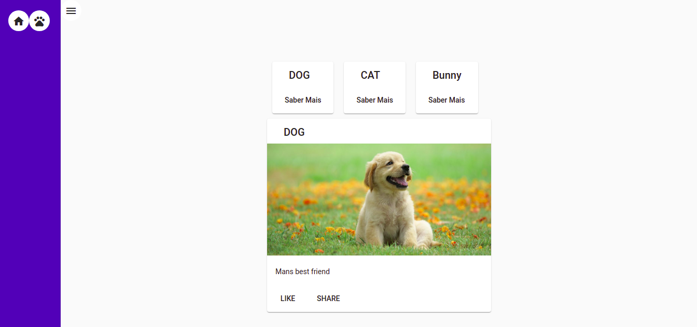

<h1 align="center">
  PETS
</h1>

<h2>

</h2>

# Indice

- [Sobre](#-sobre)
- [Tecnologia](#-tecnologia)
- [Como baixar](#-como-baixar)
---

## 📋 Sobre

Aplicação para pratica conceitual aplicados no angular no **BootCamp Avanade**, como uso de interpolação, navegação de routas property binding e o uso do Angular Material.


## 💻 Tecnologia

- [Angular](https://angular.io/)

## 📦 Como baixar

```bash 
# Clonar o repositório
$ git clone https://github.com/FelipecgPereira/pets-Angular.git

# Entrar no diretorio
$ cd pet-angular

# Instalar as dependencias caso use Yarn
$ yarn

# Instalar as dependencias caso use npm
$ npm install

# Iniciar o projeto
$ ng serve --o

```
---
Desenvolvido 🚀 por Felipe Pereira
